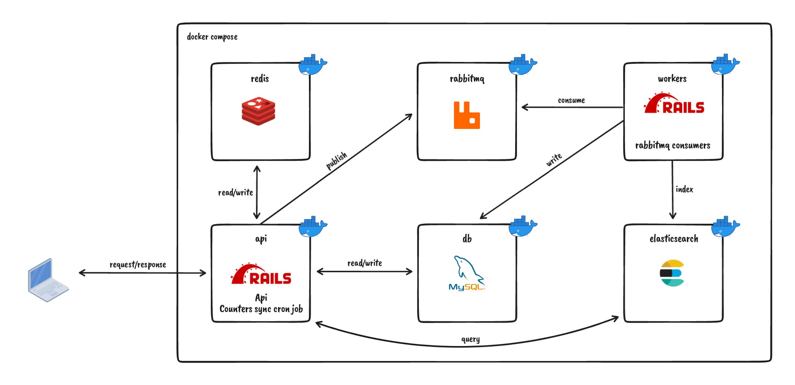

# Instabug backend challenge

> :warning: This is my first trial with use Ruby, Rails, Redis, RabbitMQ and Elasticsearch.

## Problem definition

It’s required to build a chat system. The system should allow creating new applications where
each application will have a token (generated) and a name (provided).

The token is the identifier that devices use to send chats to that application.

Each application can have many chats, and each chat should have a number.
Numbering of chats in each application starts from 1 (no 2 chats in the same application may have the same number). The
number of the chat should be returned in the chat creation request.

A chat contains messages where messages have numbers that start from 1 for each chat (no 2 messages in the chat
application may have the same number). The number of the message should also be returned in the message creation
request.

The client should never see the ID of any of the entities, The client identifies the application by its token and the
chat by its number along with the application token.

It's required to have an endpoint for searching through messages of a specific chat, It should be able to partially
match messages’ bodies (Elasticsearch should be used for this).

The applications table should contain a column called chats_count that contains the number of chats for this
application. Similarly, the chats table should contain a column called messages_count that contains the number of
messages in this chat. These columns don’t have to be live. However, they shouldn’t be lagging more than 1 hour.

Assume that the system is to receive many requests. It might be running on multiple servers in parallel and thus
multiple requests may be processed concurrently. Make sure to handle race conditions.

Try to minimize the queries and avoid writing directly to MySQL while serving the requests (especially for the chats and
messages creation endpoints). You can use a queuing system to achieve that.

It is allowed for chats and messages to take time to be persisted.

You should optimize your tables by adding appropriate indices.
Your app should be containerized. We should only run `docker-compose up` to run the whole stack.

## Toolbox

| Category         | Tool                                                                                   | Usage                                            |
| :--------------- | :------------------------------------------------------------------------------------- | :----------------------------------------------- |
| Base             | [Ruby on rails (V5)](https://rubyonrails.org/)                                         |                                                  |
| Database         | [MySQL](https://www.mysql.com/)                                                        |                                                  |
| Cache            | [Redis](https://redis.io/)                                                             | A global store to track custom numbering         |
| Queueing         | [RabbitMQ](https://www.rabbitmq.com/) + [Sneakers](https://github.com/jondot/sneakers) | Queuing/consuming chat/message creation requests |
| Search           | [Elasticsearch](https://www.elastic.co/elasticsearch/)                                 | Searching in messages' content                   |
| Scheduling       | Cron + [whenever](https://github.com/javan/whenever)                                   | Scheduling counters sync job                     |
| Containerization | [Docker](https://www.docker.com/)                                                      | Base environment for the app to run inside       |
| Commits          | [Conventional Commits](https://www.conventionalcommits.org/en/v1.0.0/)                 |                                                  |
| CI               | GitHub actions                                                                         |                                                  |

### High level diagram



## Phases

### Analysis

#### Database design

##### Application

| column      | details           |
| :---------- | :---------------- |
| id          | PK, int, not null |
| token       | uuid, not null    |
| name        | string, not null  |
| chats_count | int, default: 0   |

##### Chats

| column         | details                                                 |
| :------------- | :------------------------------------------------------ |
| id             | PK, int, not null                                       |
| application_id | FK (Application.Id), int, not null                      |
| number         | int, int, not null (starts from 1 for each application) |
| messages_count | int, default: 0                                         |

##### Messages

| column  | details                                          |
| :------ | :----------------------------------------------- |
| id      | PK, int, not null                                |
| chat_id | FK (Chats.Id), int, not null                     |
| number  | int, int, not null (starts from 1 for each chat) |
| content | string, not null                                 |

#### API Design

##### Models

```()
Message: {
    number: int;
    content: string;
}
```

```()
Chat: {
    messages_count: int;
    messages: Message[ ];
}
```

##### Endpoints

Application routes

1. POST /applications

    Request

    ```()
    {
        name: string;
    }
    ```

    Response

    ```()
    {
        token: uuid;
    }
    ```

2. GET /applications/[application_token]

    Response

    ```()
    {
        name: string;
        chats_count: int;
    }
    ```

Chat routes

1. POST /application/[application_token]/chat

    Response

    ```()
    {
        chat_number: int;
    }
    ```

2. GET /application/[application_token]/chat/[chat_number]

    Response

    ```()
    {
        messages_count: int;
        messages: Message[];
    }
    ```

3. GET /application/[application_token]/chat/[chat_number]/search?q=[search_terms]

    Response

    ```()
    {
        messages: Message[];
    }
    ```

Message routes

1. POST /application/[application_token]/chat/[chat_number]/message

    Request

    ```()
    {
        content: string;
    }
    ```

    Response

    ```()
    {
        message_number: int;
    }
    ```

2. GET /application/[application_token]/chat/[chat_number]/messages/[message_number]

    Response

    ```()
    {
        content: string;
    }
    ```

### Implementation

- [x] Init rails inside docker environment.
- [x] Implement basic crud operations for all entities (without numbering and queueing)
- [x] Implement entity numbering
- [x] Implement queueing
- [x] Implement search endpoint along with elastic search connection
- [x] Unit testing
- [x] Refactoring
- [x] Counters sync cron job

## API Testing (using [cURL](https://curl.se/))

### Application tests

1. Create application

    ```bash
    curl -X POST \
      http://localhost:3000/api/v1/application \
      -H 'content-type: application/json' \
      -d '{ "name": "Test app" }'
    ```

1. Get an application

    ```bash
    curl http://localhost:3000/api/v1/application/{token} \
      -H 'content-type: application/json'
    ```

1. Get all applications

    ```bash
    curl http://localhost:3000/api/v1/application \
      -H 'content-type: application/json'
    ```

1. Update application name

    ```bash
    curl -X PUT \
      http://localhost:3000/api/v1/application/{token} \
      -H 'content-type: application/json' \
      -d '{ "name": "Test app 2" }'
    ```

### Chat tests

1. Create a chat

    ```bash
    curl -X POST \
      http://localhost:3000/api/v1/application/{token}/chat \
      -H 'content-type: application/json'
    ```

1. Get a chat of some application

    ```bash
    curl http://localhost:3000/api/v1/application/{token}/chat/{chat_number} \
      -H 'content-type: application/json'
    ```

1. Get all chat of some application

    ```bash
    curl http://localhost:3000/api/v1/application/{token}/chat \
      -H 'content-type: application/json'
    ```

### Message tests

1. Create a message

    ```bash
    curl -X POST \
      http://localhost:3000/api/v1/application/{token}/chat/{chat_number}/message \
      -H 'content-type: application/json'\
      -d '{ "content": "Test message" }'
    ```

1. Get a message of some chat

    ```bash
    curl http://localhost:3000/api/v1/application/{token}/chat/{chat_number}/message/{message_number} \
      -H 'content-type: application/json'
    ```

1. Get all messages of some chat

    ```bash
    curl http://localhost:3000/api/v1/application/{token}/chat/{chat_number}/message/ \
      -H 'content-type: application/json'
    ```

1. Search for messages in some chat

    ```bash
    curl http://localhost:3000/api/v1/application/{token}/chat/{chat_number}/search?query={search_term} \
      -H 'content-type: application/json'
    ```

## Run unit tests

```bash
> docker compose run api bash -c "rake db:test:prepare && rails test"
```

## Tradeoffs

- Use DB table for tracking sequential numbering VS using Redis

| PROS                                                           | CONS                             |
| :------------------------------------------------------------- | :------------------------------- |
| DB easier in integration and access.                           | DB is slower.                    |
| Redis is in memory so will be faster.                          | Will increase traffic on the DB. |
| Will distribute the load to Redis instead of consuming the db. | Redis requires additional setup. |
| Chance to try working with Redis.                              | First time to use Redis.         |

---

## To improve

- [ ] Create [Index worker (Indexer)](https://github.com/elastic/elasticsearch-rails/blob/main/elasticsearch-model/README.md#asynchronous-callbacks) to index messages asynchronously.
- [ ] Move the cron job for synchronizing counters to be in its own container.
- [ ] Integration test for the whole flow (can be done in Go language).
- [ ] Improve dev environment scripts.
- [ ] Improve logging.
- [ ] Use uuid for all db ids.
- [ ] Improve seeding.
